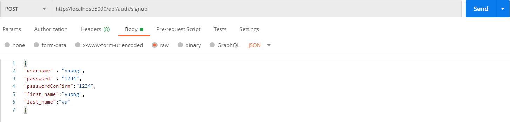
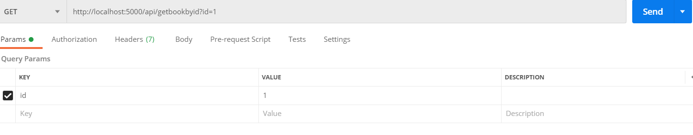
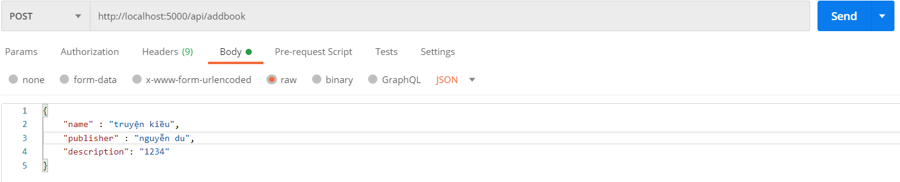
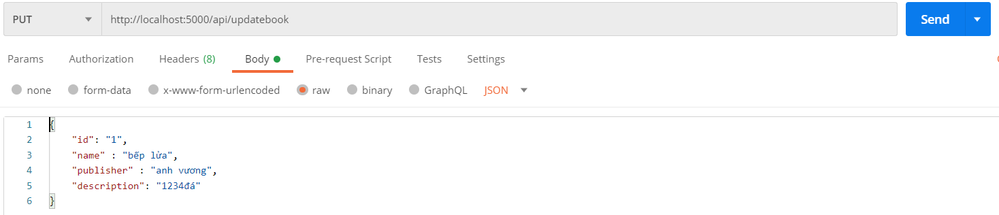

# test_setacinq

# Requirements
1. Write sample RESTful API with Nodejs that can do:

    SignUp

    Login

    GetAllBooks

    GetBookByID

    AddBook

    UpdateBookByID

2. Integrate your code from question 1 with DB SQL (Postgres).

3. Apply middleware to check authorization using JWT.


```sh
Create file .env as file .env.example
```
```sh
npm i
```
```sh
node index.js
```

# Test API

## 1. Signup

</img>

## 2. Login

</img>

## 3. GetAllBooks

</img>

## 4. GetBookByID

</img>

## 5. AddBook

</img>

## 6. UpdateBookByID

</img>


# Requirements

4. Algorithm matrix inversion: 

    input  a matrix : for example  matrix size 3*3 [[1,2,3],[4,5,6],[7,8,9]] 
    output expected  [[9,8,7],[6,5,4],[3,2,1]] 

```sh
run py matrix_inversion.py 
```
5. Write Unit Test for the function in question 4;


```sh
run py test_matrix_inversion.py 
```


