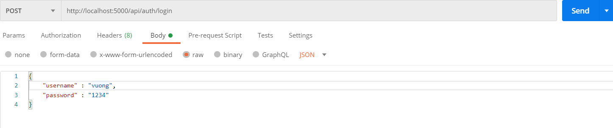
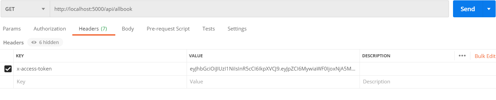

# test_setacinq

# Yêu cầu 1,2,3

```sh
Tạo file .env giống file .env.example
```
```sh
npm i
```
```sh
node index.js
```

# Test API

## 1 Signup

</img>

## 2 Login

</img>

## 3 GetAllBooks

</img>

## 4 GetBookByID

</img>

## 5 AddBook

</img>

## 6 UpdateBookByID

</img>


# Yêu cầu 4,5

```sh
run py matrix_inversion.py 
```


```sh
run py test_matrix_inversion.py 
```


